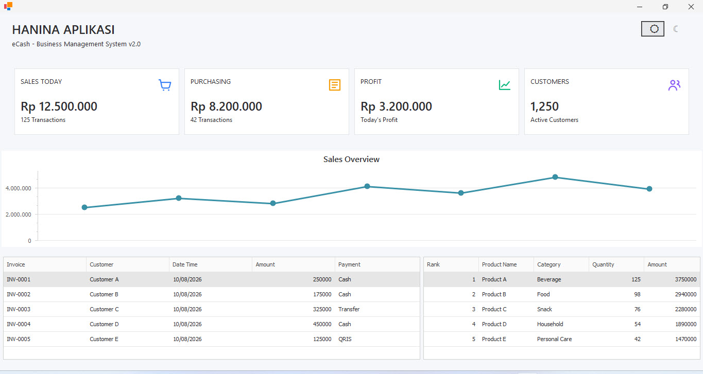
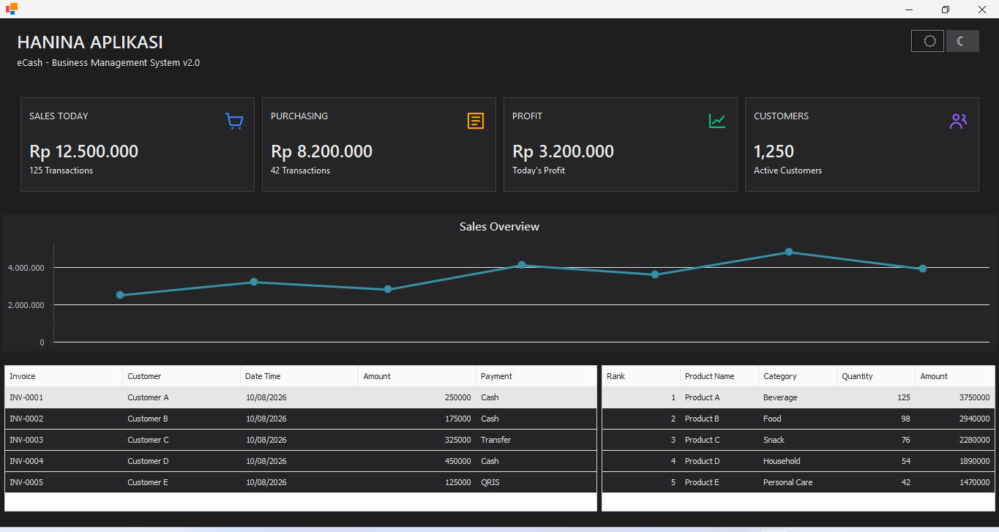

# Modern DevExpress Business UI

<p align="center">
  <strong>Modern Desktop Business Application UI</strong>
</p>

<p align="center">
  
  
  
  
</p>

<p align="center">
  A modern and responsive business application interface built with VB.NET and DevExpress.
</p>

---

## 🏢 About

**Modern DevExpress Business UI** is a desktop business application UI project developed by **Hanina Aplikasi**.

This project demonstrates how a traditional Windows Forms business application can be transformed into a modern, clean, and professional user interface using **VB.NET** and **DevExpress**.

The project focuses on reusable UI components, dashboard design, theme management, data visualization, and business-oriented desktop application patterns.

---

## 📸 Dashboard Preview

<table>
<tr>
<td width="50%">

### Light Theme



</td>
<td width="50%">

### Dark Theme



</td>
</tr>
</table>

---
## 🎯 What This Project Demonstrates

This project demonstrates practical experience in developing modern desktop business applications with a strong focus on usability, maintainability, and reusable UI components.

### UI & UX

* Modern Windows Forms interface
* Responsive desktop layout
* Consistent spacing and typography
* Light and dark themes
* Interactive dashboard cards
* SVG-based visual elements

### Business Application

* KPI dashboard
* Sales monitoring
* Purchasing monitoring
* Profit overview
* Customer overview
* Recent transactions
* Top products

### Development

* Reusable custom controls
* Centralized theme management
* DevExpress ChartControl
* DevExpress GridControl
* Component-based UI architecture
* Maintainable project structure

---

## ✨ Features

### Dashboard

* Modern business dashboard
* KPI cards
* Sales overview
* Recent transactions
* Top products
* Responsive desktop layout

### Theme System

* Light Theme
* Dark Theme
* Runtime theme switching
* Persistent theme preference
* Theme-aware dashboard components
* Theme-aware charts and data grids

### Dashboard Components

* Reusable Dashboard Card
* SVG icon support
* Hover effects
* Dynamic value colors
* Custom card styling
* Responsive icon positioning

### Data Visualization

* DevExpress ChartControl
* Sales overview visualization
* Custom chart styling
* Light/Dark chart themes

### Data Grid

* DevExpress GridControl
* Recent transactions
* Top products
* Custom column formatting
* Light/Dark grid themes

---

## 🛠️ Technology Stack

| Technology            | Purpose                              |
| --------------------- | ------------------------------------ |
| VB.NET                | Application development              |
| Windows Forms         | Desktop application framework        |
| DevExpress            | UI components and data visualization |
| DevExpress XtraCharts | Business charts                      |
| DevExpress XtraGrid   | Data grids                           |
| SVG                   | Dashboard icons                      |
| Visual Studio         | Development environment              |

---

## 🎨 UI Design

The interface is designed specifically for desktop business applications such as:

* Point of Sale (POS)
* Retail Management
* Inventory Management
* Sales Management
* Purchasing Management
* Customer Management
* Business Reporting
* Accounting Applications

The design emphasizes:

* Clean layout
* Consistent spacing
* Clear information hierarchy
* Business-oriented dashboard components
* Reusable components
* Light and dark themes

---

## 🧩 Reusable Components

One of the main goals of this project is to create reusable components that can be integrated into other business applications.

Examples include:

```text
DashboardCard
ThemeManager
ThemeSwitcher
SvgResourceHelper
```

These components are designed to simplify the development of modern Windows Forms business applications.

---

## 🏗️ Project Structure

```text
ModernDevExpressBusinessUI
│
├── Components
│   ├── DashboardCard
│   ├── ThemeManager
│   ├── ThemeSwitcher
│   └── SvgResourceHelper
│
├── Dashboard
│
├── screenshots
│   ├── dashboard-light.jpg
│   └── dashboard-dark.jpg
│
└── README.md
```

---

## 💼 Business Application Experience

This project represents the type of desktop business software development provided by **Hanina Aplikasi**.

The same approach can be applied to custom software solutions such as:

* Retail POS
* Inventory systems
* Sales applications
* Purchasing systems
* Warehouse management
* Customer management
* Business dashboards
* Custom desktop applications

---

## 👨‍💻 Developer

### Hanina Aplikasi

**Custom Desktop & Business Software Development**

Specialized in building business applications using:

* VB.NET
* C#
* DevExpress
* SQL Server
* MySQL
* Desktop POS
* Inventory Management
* Business Applications

---

## 📬 Contact

For software development, customization, or business application projects:

**Hanina Aplikasi**

GitHub: [@phophobee](https://github.com/phophobee)

---

## 📌 Portfolio

This repository is part of the **Hanina Aplikasi software development portfolio**.

The project demonstrates UI architecture, reusable components, dashboard design, data visualization, and desktop business application development using VB.NET and DevExpress.

---

<p align="center">
  <strong>Hanina Aplikasi</strong><br>
  Building Practical Software for Business
</p>
